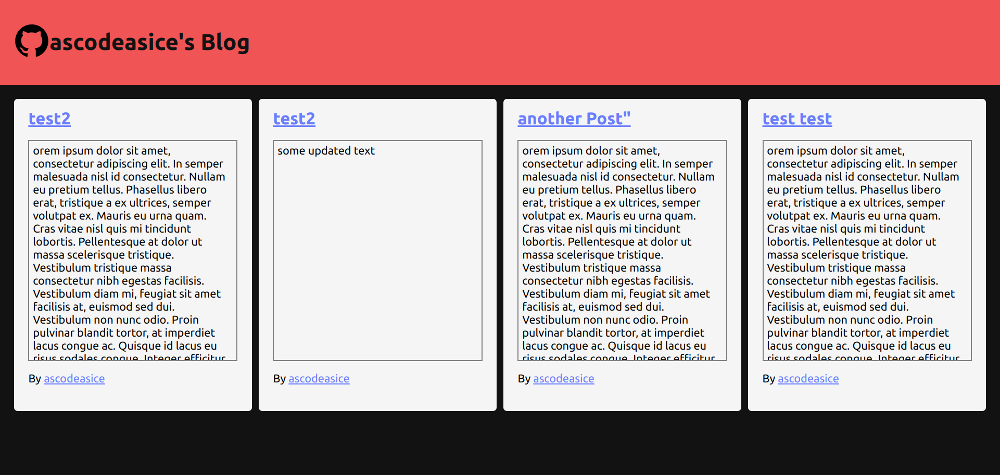
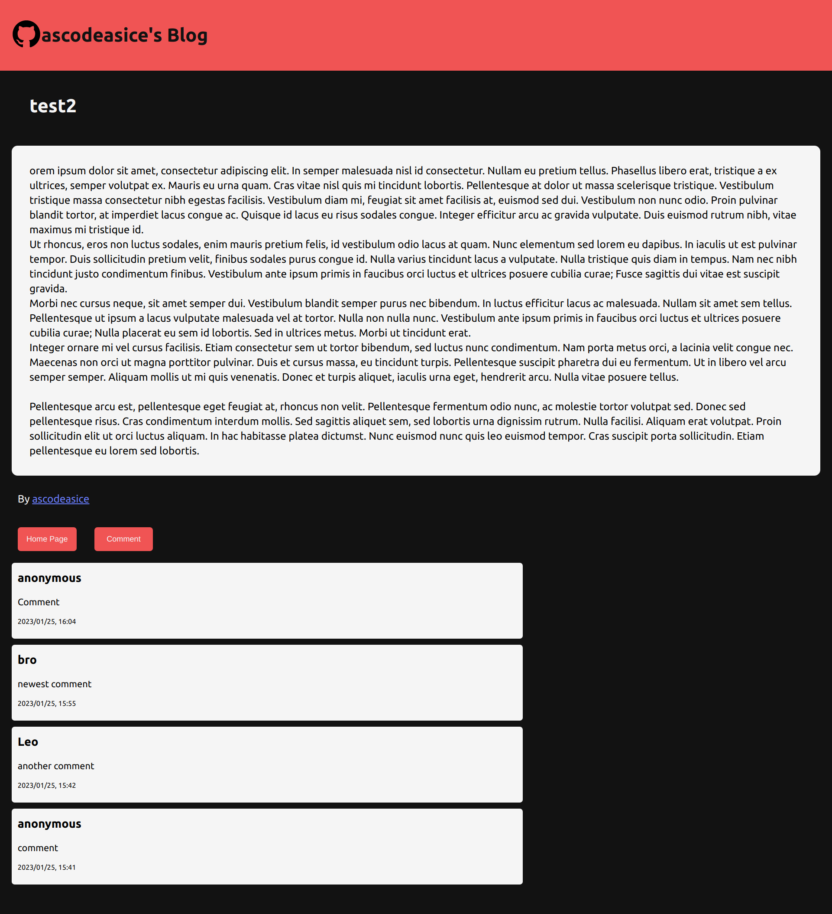

# blog-viewer
This website uses the blog API I wrote in another repo. It is a frontend website that allows user to see posts and comment.
# Details
- Use React.js frontend framework
- Use [my blog API](https://github.com/ascodeasice/blog-api) made with Express.js and mongoDB
- Use [react-markdown](https://github.com/remarkjs/react-markdown#use-a-plugin-with-options) for markdown text
# Results
## Home Page

## Post

# Link
[Live Preview](https://ascodeasice.github.io/blog-viewer/)

NOTE: The link might not work because of backend hosting 